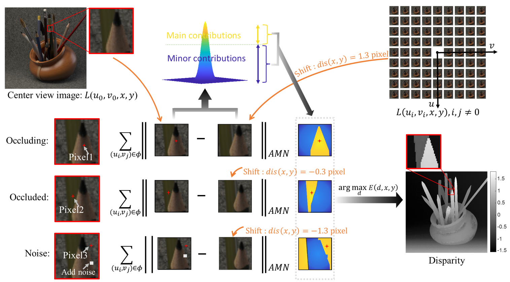

# Adaptive-Matching-Norm-Based-Disparity-Estimation-from-Light-Field-Data

Abstract: The spatial-angular coupling relationship of light field data is fundamental for the scene-disparity estimation. However, the ideal coupling relationship is destructed in the occlusion, noise and non-Lambertian radiation regions, making it a challenge to reconstruct the disparity in these regions. Based on the spatial-angular coupling relationship, we proposed an adaptive matching norm for light field data to measure the angular consistency, and to achieve automatic anti-occlusion, anti-noise and anti-non-Lambertian radiance performance for scene disparity estimation. To enhance the contribution of the manifold light field data and decrease the contribution of the non-manifold light field data to the matching norm, the pixel differences are mapped to Gaussian distribution. As a result, the adaptive matching norm can describe the angular consistency of the manifold light field data, and automatically suppress the destruction of the angular consistency in the non-manifold light field data without the need to identify occlusion and analyze noise. The experimental results show that disparity estimation based on the adaptive matching norm can automatically and effectively deal with the matching problems in the occlusion, noise, and non-Lambertian regions, hence achieve high-precision disparity estimation results both in synthetic and real datasets.

keywords = Light field, Disparity estimation, Angular consistency, Adaptive matching norm, Anti-occlusion, Anti-noise



The schematic diagram of disparity estimation by the proposed adaptive matching norm for region matching. The pixels make main contributions for matching norm are labeled in yellow, while the pixels make minor contributions are labeled in blue. Pixel1, Pixel2 and Pixel3 in the central image are in the occluding region, the occluded region and the noise region respectively. For example, When computing the disparity for Pixel1, the occluding pixels are the standardized light field data and make main contributions, while the occluded pixels are the non-standardized light field data and make minor contributions.

##Citation
````
@article{LIU2023109042,
title = {Adaptive matching norm based disparity estimation from light field data},
journal = {Signal Processing},
volume = {209},
pages = {109042},
year = {2023},
issn = {0165-1684},
doi = {https://doi.org/10.1016/j.sigpro.2023.109042},
url = {https://www.sciencedirect.com/science/article/pii/S0165168423001160},
author = {Chang Liu and Ligen Shi and Xing Zhao and Jun Qiu},
}
````
